<div align="center">

# 🎓 SemantiGrade AI

### Automated Semantic Answer Sheet Grading & Generative Feedback Engine

[](https://python.org)
[](https://pytorch.org)
[](https://streamlit.io)
[](https://ollama.com)
[](LICENSE)

**A hybrid NLP-based automated grading system combining semantic embeddings,  
syntactic concept analysis, lexical similarity, OCR, and local LLM-generated feedback.**

</div>

---

## 📌 Overview

**SemantiGrade AI** is an automated answer evaluation system designed to overcome the limitations of traditional keyword-based grading.

Instead of relying only on exact keyword matching, the system evaluates student answers using a **hybrid NLP scoring architecture** that combines:

- Dense semantic similarity using **Sentence-BERT**
- Technical concept coverage using **POS-based noun phrase extraction**
- Lexical similarity using **bi-gram Jaccard overlap**
- OCR-based extraction from scanned answer sheets
- Local generative feedback using **Ollama and Llama 3**
- Interactive visualization through **Streamlit**

This allows answers with different wording, sentence structures, or synonyms to receive appropriate scores when their underlying meaning is correct.

---

## ✨ Key Features

### 📄 OCR-Based Answer Extraction
Extracts text directly from scanned PDFs and images using **Tesseract OCR** and `pdf2image`.

### 🧠 Dense Semantic Embeddings
Uses `all-MiniLM-L6-v2` from Sentence-Transformers to convert answers into **384-dimensional vector embeddings** and calculate semantic similarity.

### 🏷️ Concept Coverage Analysis
Uses NLTK POS tagging and chunking to identify important technical noun phrases and measure how many reference concepts are covered by the student's answer.

### 🔤 Lexical Similarity
Uses **bi-gram Jaccard similarity** to measure overlap in multi-word phrases between student and reference answers.

### 🤖 Local LLM Feedback
Generates diagnostic feedback and missing-concept summaries using a local **Ollama / Llama 3** model, with optional cloud fallback.

### 📊 Interactive Analytics
Provides grading statistics, metric distributions, and evaluation visualizations through a **Streamlit dashboard**.

### ⚡ AMD GPU Acceleration
Supports AMD GPU acceleration through the **ROCm-enabled PyTorch runtime**.

---

## 📐 Architecture & Pipeline Flow

```mermaid
flowchart TD

    A["Input: Scanned PDF / Image / Text"]
    B["OCR Engine: Tesseract"]
    C["Preprocessing & POS Tagging: NLTK"]

    D["Lexical & Syntactic Analysis"]
    D1["Bi-Gram Jaccard Overlap"]
    D2["Noun Phrase Concept Recall"]
    D3["Lexical Precision"]

    E["Deep Semantic Analysis"]
    E1["SentenceTransformer: all-MiniLM-L6-v2"]
    E2["Vector Cosine Similarity"]

    F["Weighted Hybrid Scoring"]

    G["60% Semantic"]
    G2["25% Concept"]
    G3["15% Lexical"]

    H["Local Generative LLM Feedback"]
    I["Ollama / Llama 3"]
    J["Streamlit UI & Analytics"]

    A --> B
    B --> C

    C --> D
    C --> E

    D --> D1
    D --> D2
    D --> D3

    E --> E1
    E1 --> E2

    D1 --> F
    D2 --> F
    D3 --> F
    E2 --> F

    F --> G
    F --> G2
    F --> G3

    G --> H
    G2 --> H
    G3 --> H

    H --> I
    I --> J
```



---

## 🔄 Pipeline Explanation

| Stage | Technology | Function |
|---|---|---|
| **Input** | PDF / Image / Text | Accepts digital or scanned answer sheets |
| **OCR** | Tesseract + pdf2image | Extracts text from scanned documents |
| **Preprocessing** | NLTK | Cleans, tokenizes, and POS-tags text |
| **Lexical Analysis** | Bi-Gram Jaccard | Measures phrase-level lexical overlap |
| **Concept Analysis** | POS Chunking | Measures reference concept coverage |
| **Semantic Analysis** | SentenceTransformer | Generates dense sentence embeddings |
| **Similarity** | Cosine Similarity | Measures semantic similarity |
| **Hybrid Scoring** | Weighted Matrix | Combines all grading metrics |
| **LLM Feedback** | Ollama + Llama 3 | Generates qualitative feedback |
| **Visualization** | Streamlit | Displays scores and analytics |

---

## 🧮 Mathematical Scoring Model

The final grade is calculated on a **10-point scale** using a weighted hybrid scoring formula:

$$
\text{Final Grade}
=
\left(
0.60S_{\text{sem}}
+
0.25C_{\text{cov}}
+
0.15B_{\text{over}}
\right)
\times 10
$$

### 1. Semantic Similarity — 60%

$$
S_{\text{sem}}
=
\frac{\mathbf{u}\cdot\mathbf{v}}
{\|\mathbf{u}\|\|\mathbf{v}\|}
$$

Measures the cosine similarity between the student's answer embedding and the reference answer embedding.

The embeddings are generated using **SentenceTransformer (`all-MiniLM-L6-v2`)**.

### 2. Concept Coverage — 25%

$$
C_{\text{cov}}
=
\frac{
|NP_{\text{student}}\cap NP_{\text{reference}}|
}{
|NP_{\text{reference}}|
}
$$

Measures how many important reference concepts are present in the student's answer.

The concepts are extracted using **NLTK POS tagging and noun-phrase chunking**.

### 3. Bi-Gram Overlap — 15%

$$
B_{\text{over}}
=
\frac{
|G_{\text{student}}\cap G_{\text{reference}}|
}{
|G_{\text{student}}\cup G_{\text{reference}}|
}
$$

Calculates the **Jaccard similarity** between student and reference word bi-grams.

---

## 📊 Scoring Weights

| Metric | Weight | Purpose |
|---|---:|---|
| Semantic Similarity | **60%** | Measures meaning and contextual similarity |
| Concept Coverage | **25%** | Measures retention of important technical concepts |
| Bi-Gram Overlap | **15%** | Measures lexical and phrase-level similarity |
| **Total** | **100%** | **Final Hybrid Score** |

The high semantic weight allows the system to recognize **correct answers expressed using different wording** while concept and lexical metrics provide additional grading evidence.

---

## 📂 Repository Structure

```text
SemantiGrade-AI/
│
├── app.py
├── evaluate.py
├── evaluator.py
├── fix_csv.py
├── llm_feedback.py
├── ocr_engine.py
├── preprocessor.py
├── semantic_grader.py
├── syntactic_grader.py
├── verify_and_visualize.py
├── visualize_full_pipeline.py
│
├── dataset.csv
├── dataset_fixed.csv
├── exp1_preprocessed_output.csv
├── full_graded_dataset.csv
├── midsem_syntactic_features.csv
│
├── final_hybrid_grading_visuals.png
├── midsem_grading_visuals.png
│
├── requirements.txt
└── README.md
```

### Core Modules

| File | Description |
|---|---|
| `app.py` | Streamlit web application |
| `evaluate.py` | Evaluation runner |
| `evaluator.py` | Core hybrid grading and scoring logic |
| `ocr_engine.py` | OCR and PDF/image extraction |
| `preprocessor.py` | Text cleaning and preprocessing |
| `semantic_grader.py` | SBERT embeddings and cosine similarity |
| `syntactic_grader.py` | Bi-gram overlap and concept coverage |
| `llm_feedback.py` | LLM feedback generation |
| `verify_and_visualize.py` | Verification and edge-case testing |
| `visualize_full_pipeline.py` | Analytics and visualization generation |

---

## 🚀 Quick Start

### 1. Prerequisites

Make sure the following are installed:

- Python **3.12**
- Git
- Tesseract OCR
- Poppler
- Ollama
- PyTorch
- Streamlit

### 2. Install System Dependencies

For Ubuntu/Debian:

```bash
sudo apt update
sudo apt install -y tesseract-ocr poppler-utils
```

### 3. Clone the Repository

```bash
git clone https://github.com/YOUR_USERNAME/SemantiGrade-AI.git
cd SemantiGrade-AI
```

### 4. Create a Virtual Environment

```bash
python3 -m venv .venv
source .venv/bin/activate
```

### 5. Install Python Dependencies

For AMD GPU systems using ROCm:

```bash
pip install torch torchvision torchaudio \
    --index-url https://download.pytorch.org/whl/rocm6.2
```

Then install the remaining dependencies:

```bash
pip install -r requirements.txt
```

> **Note:** Use the ROCm version compatible with your installed AMD GPU and PyTorch environment.

### 6. Start Ollama

Install Ollama and pull the required model:

```bash
ollama pull llama3
```

Start the model:

```bash
ollama run llama3
```

The default Ollama API is available at:

```text
http://localhost:11434
```

### 7. Enable AMD GPU Acceleration

If required for your AMD GPU configuration:

```bash
export HSA_OVERRIDE_GFX_VERSION=11.0.0
```

### 8. Launch the Streamlit Application

```bash
python -m streamlit run app.py
```

The application will be available at:

```text
http://localhost:8501
```

---

## 🖥️ Application Workflow

```text
Student Answer Sheet
        │
        ▼
     OCR / Text
        │
        ▼
  Text Preprocessing
        │
        ├───────────────┐
        ▼               ▼
 Lexical/Concept    Semantic
   Analysis         Analysis
        │               │
        └───────┬───────┘
                ▼
        Hybrid Score
                │
                ▼
        LLM Evaluation
                │
                ▼
      Feedback Generation
                │
                ▼
      Streamlit Dashboard
```

---

## 🔐 Privacy & Local Processing

A key design objective of SemantiGrade AI is **privacy-preserving evaluation**.

When using the local Ollama deployment:

- Student answers remain on the local machine.
- LLM feedback is generated locally.
- No student answer needs to be transmitted to an external LLM API.
- The system can operate without cloud-based LLM inference.

An optional cloud-based fallback can be configured when required.

---

## 🧪 Evaluation

The project includes scripts for:

- Dataset preprocessing
- Feature extraction
- Hybrid score calculation
- Edge-case verification
- Statistical analysis
- Visualization
- Final graded dataset generation

Generated evaluation artifacts include:

```text
full_graded_dataset.csv
midsem_syntactic_features.csv
final_hybrid_grading_visuals.png
midsem_grading_visuals.png
```

---

## 🛠️ Technology Stack

| Category | Technology |
|---|---|
| Programming Language | Python 3.12 |
| NLP | NLTK |
| Semantic Embeddings | SentenceTransformers |
| Embedding Model | all-MiniLM-L6-v2 |
| OCR | Tesseract |
| PDF Processing | pdf2image / Poppler |
| Deep Learning | PyTorch |
| GPU Acceleration | AMD ROCm |
| LLM | Llama 3 |
| Local Inference | Ollama |
| Web Interface | Streamlit |
| Data Processing | Pandas / NumPy |
| Visualization | Matplotlib / Seaborn |

---

## 🎯 Project Objectives

1. Develop an automated system for evaluating open-ended student answers.
2. Reduce dependency on exact keyword matching.
3. Incorporate semantic similarity into answer grading.
4. Measure important technical concept coverage.
5. Support evaluation of scanned answer sheets using OCR.
6. Generate meaningful automated feedback using a local LLM.
7. Provide an interactive dashboard for grading analysis.

---

## 🔮 Future Scope

- Multi-language answer evaluation
- Handwritten answer recognition
- Question-aware grading
- Rubric-based evaluation
- Explainable AI scoring
- Teacher-configurable scoring weights
- Batch processing of complete answer sheets
- Improved OCR for handwritten documents
- Fine-tuned domain-specific embedding models
- Integration with college LMS platforms

---

## 👨‍💻 Project

**SemantiGrade AI**  
Automated Semantic Answer Sheet Grading & Generative Feedback Engine

Built using **Python, NLP, Sentence Transformers, OCR, PyTorch, Ollama, Llama 3, and Streamlit**.

---

## 📄 License

This project is licensed under the **MIT License**. See the [LICENSE](LICENSE) file for details.
